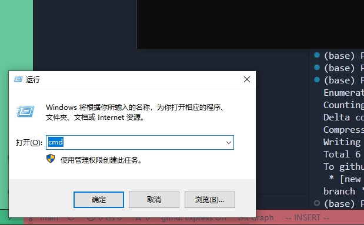

# 使用方法
1. 在电脑上安装python环境（比较难，随时问我！）

2. 如图点击下载压缩包

3. 解压缩压缩包
4. 键盘按 windows和r，在弹出的小窗中输入cmd，回车

5. 进入解压文件夹，点击地址栏，复制出路径

6. 将赋值出来的值,单击鼠标右键黏贴到第3步打开的黑窗口中，并在最前面输入"cd", 最后按回车

7. 在黑窗口中输入  pip install openpyxl ，最后按回车

8. 运行程序
把需要提注批注的excel放到这个文件夹下
在刚才黑窗中输入

python comments.py --in_xlsx 需要提取的excel  --out_txt 输出的txt文件

例如使用zip包中的示例
python comments.py --in_xlsx test.xlsx --out_txt test.txt

在test.txt中就会有结果